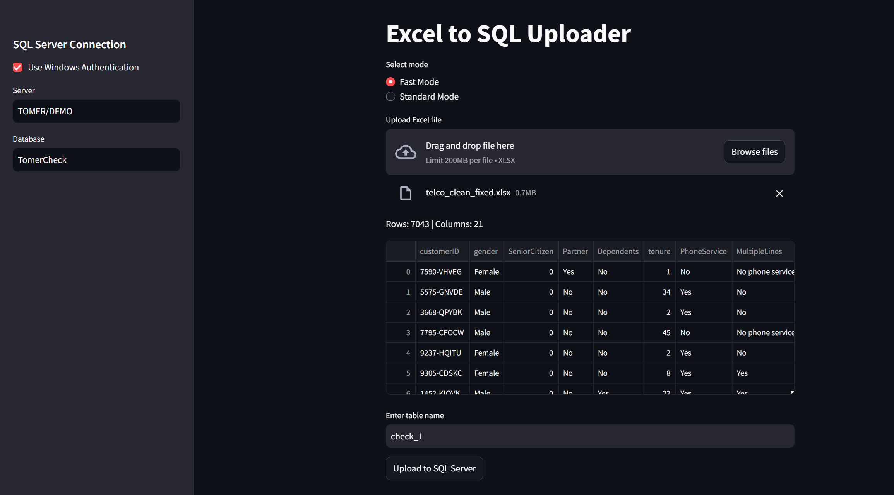

# Excel to SQL Uploader


A lightweight Streamlit web app for uploading Excel files and inserting their contents into a SQL Server database.

## Features

- Upload `.xlsx` files via a clean UI
- Automatically map Excel columns to SQL table schema
- Create new tables and insert data with no coding required

## How to Run

### Option 1 – One-click on Windows:
Double-click `install.bat`  
Follow the instructions on screen. The browser will open automatically.

### Option 2 – Manual:
```bash
pip install -r requirements.txt
streamlit run app.py


### בעברית


# Excel to SQL Uploader (גרסה מקומית)

כלי פשוט מבוסס Streamlit שמאפשר למשתמשים להעלות קובץ Excel ולהכניס את תוכנו ישירות לטבלת SQL Server – ללא צורך בכתיבת קוד.


## איך להפעיל את המערכת

לחיצה כפולה על install.bat
לחיצה על "מידע נוסף" והתקנה
הדף יפתח אוטומטית

## סיימת!

המערכת תיצור טבלה חדשה במסד הנתונים ותעלה לתוכה את כל הנתונים מהאקסל.
בהצלחה!
